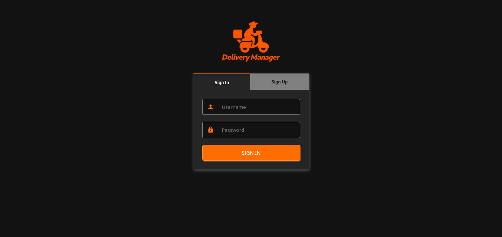
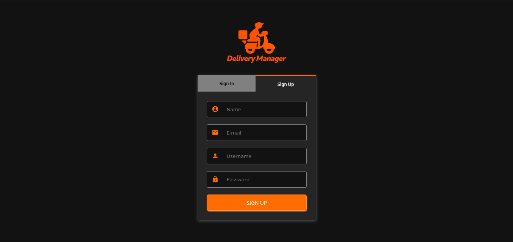

# Delivery Manager

Delivery project in ReactJS, NodeJS and MongoDB

## Features

- CRUD
- Routes
- API RESTful
- MUI DataTable
- Filter
- Pagination
- Login
- ACL
- JWT
- Responsive

## Requirements

- Node >= 14.11.0
- NPM >= 6.14.8
- MongoDB >= 4.2.7

## Tecnologies

- NodeJS
- Express
- Passport
- Mongoose
- ReactJS
- CSS
- Material-UI

## Instalation

```
$ git clone https://github.com/danilomeneghel/delivery-manager.git

$ cd delivery-manager/
```

Change the config/db.js file according to your database data. 
Open the terminal, then run Mongodb:

```
$ mongod
```

To run the application, run the following command:

```
$ npm install && npm run start
```


If it doesn't work, try installing the dependencies and running separately.

```
$ cd backend && npm install && npm start
$ cd frontend && npm install && npm start
```

http://localhost:3000/


## Demonstration

https://etko4.csb.app/

- Login
    - Username: admin
    - Password: admin123

## License

This project is licensed under <a href="LICENSE">The MIT License (MIT)</a>.<br>

## Screenshots

<br><br>
<br><br>
<br><br>
<br><br>
<br><br>
<br><br>
<br><br>


Developed by<br>
Danilo Meneghel<br>
danilo.meneghel@gmail.com<br>
http://danilomeneghel.github.io/<br>
